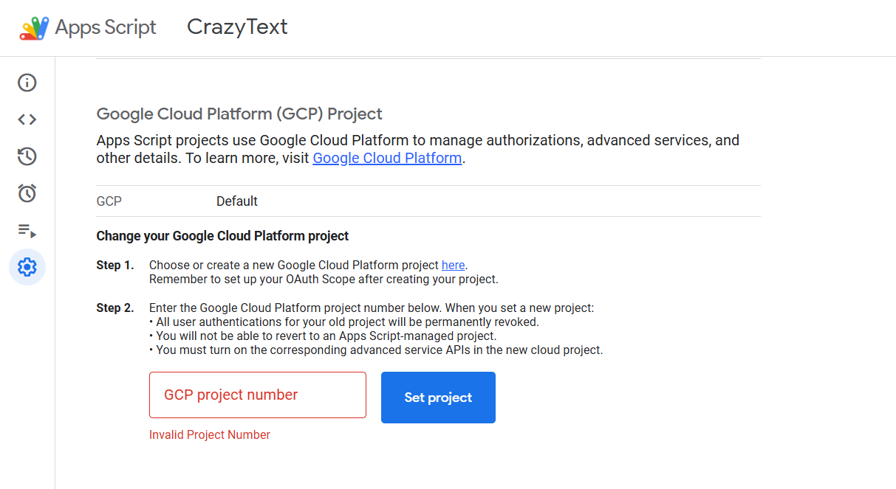
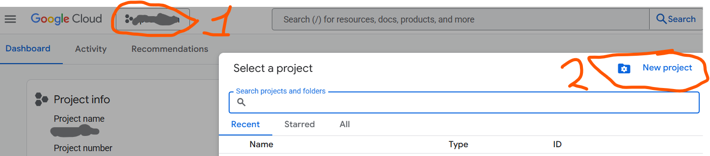
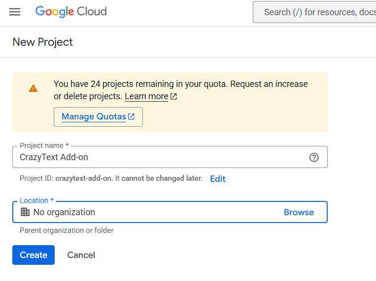
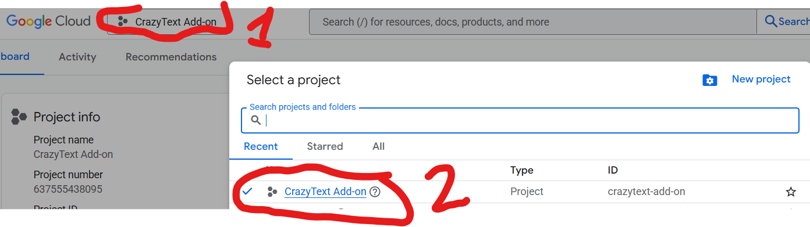
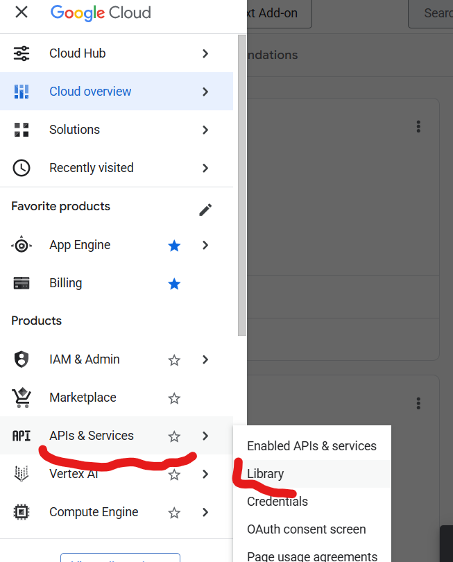
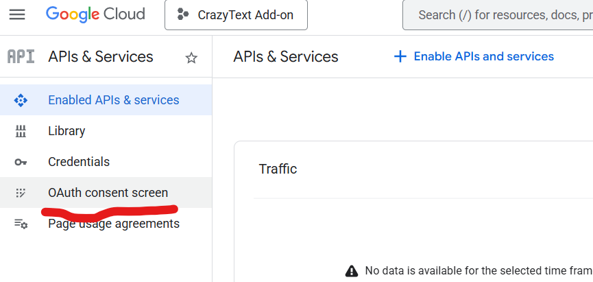
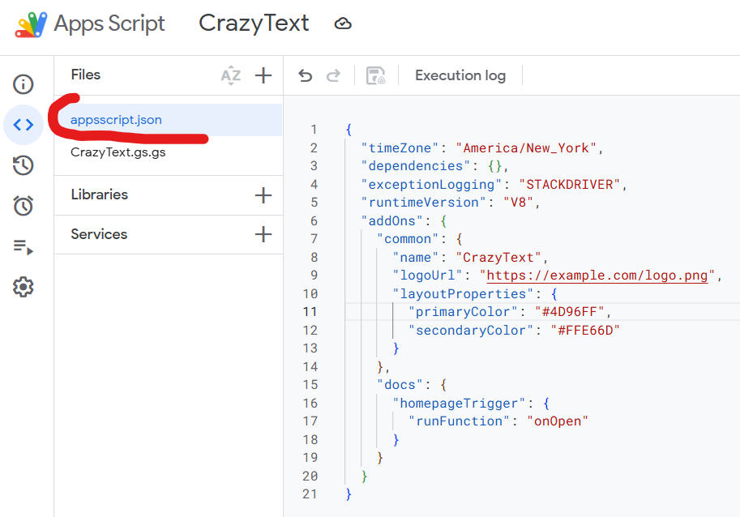
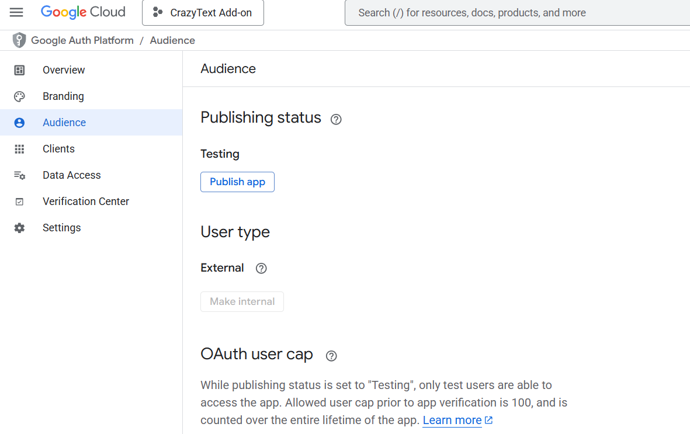
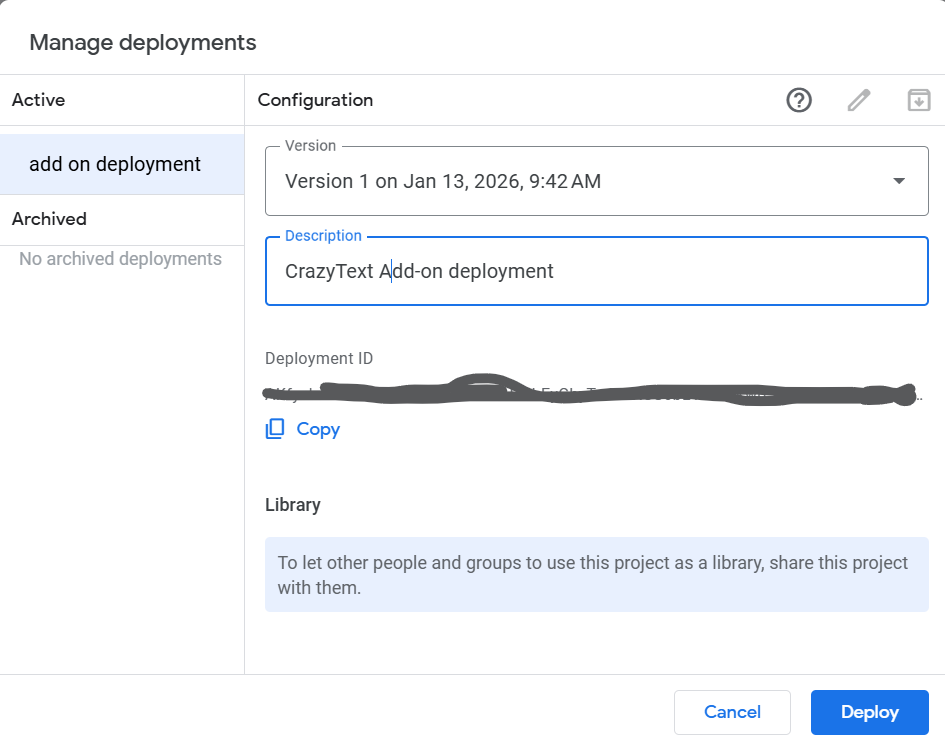

# What functionality

## Step 1

Generate simple Google Docs add-on called CrazyText, that highlight each letter with different/ random color. It is written on Apps Script.

### Step 1 Instructions

1. Open any [Google Docs document](https://docs.google.com/document/d/1BRrymjFEmmJ1aaGQwl070vmANN6Yiaewgx2Xmv9Qcrw/edit?tab=t.0) where you want to develop the add-on.
2. Go to **Extensions → Apps Script** to create a new bound script project.
3. Delete the default `Code.gs` content, then paste the entire contents of [CrazyText.gs](CrazyText.gs) into the editor.
4. Rename the script file to `CrazyText.gs` if needed, then press **Ctrl+S** (or click **Save**) to persist the code.
5. Run the `onOpen` function once to authorize the script when prompted (select **Review permissions**, pick your Google account, and allow the required scopes).
6. Return to the Google Doc, refresh the page, and confirm the **CrazyText** menu appears in the toolbar with the highlighting actions.

## Step 2

Make detailed instruction how to configure Google Cloud Project and connect scriped CrazyText created on step 1 to this project.
Then Google Workspace Marketplace SDK need to be configured in Private or Unlisted mod to give possibility to send link to the customer/user for plugin installation.
User must not be allowed to have access to source code of the plugin

### Step 2 Instructions

1. In the Apps Script editor, open **Project Settings → Google Cloud Platform (GCP) project** and click **Change project** . Choose **Create a project** , name it `CrazyText Add-on`, and confirm. This links the script to a dedicated GCP project that you control.
2. Visit the [Google Cloud Console](https://console.cloud.google.com/) while logged into the same account. Select the newly created `CrazyText Add-on` project. 
3. Enable the required services via **APIs & Services → Library** : turn on **Google Docs API**, **Apps Script API**, and **Google Workspace Marketplace SDK**.
4. Configure OAuth consent under **APIs & Services → OAuth consent screen**. Set the user type to **Internal** (recommended) or **External** with limited test users, supply the basic app information, and add the scopes shown in the Apps Script manifest (Docs and Script scopes). Save and publish the consent screen to **Testing**. **APIs & Services → OAuth consent screen  → Audience -> Publish app**
5. Back in the Apps Script editor, open **Project Settings → Show "appsscript.json" manifest file in editor** and confirm the project contains a Docs add-on host entry. If missing, replace the manifest with the snippet below, then adjust the add-on name, logo, and homepage trigger if desired:

```json

{
  "timeZone": "America/New_York",
  "dependencies": {},
  "exceptionLogging": "STACKDRIVER",
  "runtimeVersion": "V8",
  "oauthScopes": [
        "https://www.googleapis.com/auth/documents.currentonly",
        "https://www.googleapis.com/auth/script.container.ui"
  ],
  "addOns": {
    "common": {
      "name": "CrazyText",
      "logoUrl": "https://example.com/logo.png",
      "layoutProperties": {
        "primaryColor": "#4D96FF",
        "secondaryColor": "#FFE66D"
      }
    },
    "docs": {
      "homepageTrigger": {
        "runFunction": "onOpen"
      }
    }
  }
}

```



6. Once the manifest lists the Docs host, open **Deploy → Test deployments → Select type → Add-on** and create a test deployment to validate the menu.
7. After testing, delete any previous **Head** deployments so no outdated IDs linger. Then open **Deploy → Manage deployments → New deployment**, choose **Select type → Add-on**, confirm Docs is the only host shown, and publish the new deployment. Copy the deployment ID from this dialog; this is the one required for the Marketplace listing. The script’s permanent **Script ID** (needed for API/service details) resides under **Project Settings → IDs → Script ID** in Apps Script; add version (only digit); copy it now for later steps.
8. Return to the Cloud Console and open **Google Workspace Marketplace SDK=>Manage**. In the **Configuration** tab, choose Public and check Unlisted, choose Individual + Admin Install. In app integrations choose **Google Workspace add-on**, choose the **Apps Script project** by entering the deployment ID from step 7, and select the Docs add-on category. Script id you can find in Apps Script -> Project Settings-> IDs -> Script ID. Supply the add-on manifest details as prompted. 
9. In the **Publishing** tab, pick **Private** (restricted to specific domains) or **Unlisted** distribution. Provide the list of allowed users or domains. This keeps the listing hidden from the public catalog while giving you an install link.

- For private apps, your app listing is immediately available to everyone in your Google Workspace organization.
- For public apps, your app is reviewed by Google. After Google approves your app, your app listing is available to everyone in the Marketplace. To learn about the status of a public app, see Check your app listing's publication status.

10. Provide a secure install link to customers via **Google Workspace Marketplace SDK → Publishing → Test & publish**. In that screen, click **Share installation link** to generate the URL. Share the link only with end users; do not grant them edit access to the Apps Script project or the linked Google Cloud project.
11. For ongoing updates, edit the code in Apps Script, then increment the deployment via **Deploy → Manage deployments → Edit**. Users installing through the Marketplace link receive the latest deployed version without seeing the source.
